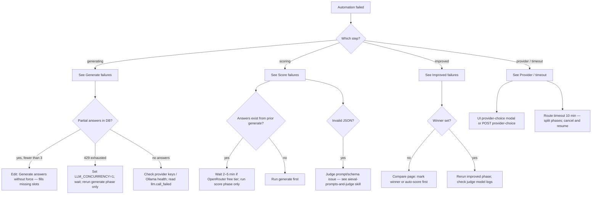

# AiEval automation debug

## Quick triage

1. Identify **phase**: `full`, `generate`, `score`, or `improved` (UI button or SSE `status` / last progress before `error`).
2. Find **runId** and **evaluationId** in the UI automation card, server terminal, or log lines.
3. Read logs: `LOG_FILE` (see `.env`) or `logs/server.ndjson` in the repo root.
4. Match failure to **step**: `generating` | `scoring` | `improved` | `provider` (from `AutomationError.step` or log `step` field).

## Decision tree

## Log events to search

| Symptom | Search for | Meaning |
|---------|------------|---------|
| Rate limit | `llm.rate_limit`, `429` | Retries exhausted for that call |
| Step stalled | `automation.pipeline_step`, `step_paused` | Generate checkpointed; fallbacks running |
| Model switch | `automation.provider_fallback`, `model_fallback` SSE | Per-slot or judge moved to next model |
| Judge failure | `automation.scoring`, `automation.failed`, `step: scoring` | Batch judge call failed |
| Cancelled | `automation.cancelled` | User stop or new run superseded old runId |
| Slow Ollama | `llm.slow_fallback`, `slow_provider_prompt` | User must choose cloud or wait |

Filter by `evaluationId` and `runId` when multiple runs exist.

## SSE events (client)

Key `AutomationProgressEvent` types from the stream:

- `provider_resolved` — which provider/models were chosen
- `generating` / `answer_generated` — per-slot progress (full pipeline: 3 answers)
- `step_paused` — rate limits; partial save; sequential fallback next
- `model_fallback` — which model replaced a failed slot
- `scoring_batch` / `scored` / `winner_picked` — judge phase
- `improved_done` / `complete` — success
- `error` — message + failed step; check logs for root cause

Correlate SSE `runId` with log `runId` for the same automation session.

## Recovery playbook

### Partial generate (resume)

- Evaluation has **fewer than 3 answers**, no winner, valid prompt + criteria.
- On **Edit**, click **Generate answers** **without** force confirm.
- Server fills **missing slots only** (`pendingSlotIndices` in `resilient-llm.ts`).

### Split phases after quota or timeout

1. **Generate** on Edit (`phase=generate`) — wait until 3 answers exist.
2. Wait (especially OpenRouter free tier) — see `aieval-openrouter-free-tier` skill.
3. **Auto-score** on Compare (`phase=score`).
4. **Generate improved** on Improved (`phase=improved`).

### Force re-run

- UI asks to confirm when replacing existing answers, scores, or improved draft.
- API: `GET /api/evaluations/:id/automate/stream?force=true&phase=<phase>`.

### Environment knobs (`.env`)

| Variable | When to change |
|----------|----------------|
| `LLM_CONCURRENCY=1` | OpenRouter free / slow Ollama / parallel 429s |
| `LLM_INTER_CALL_DELAY_MS` | Raise to 1000–2000 between calls |
| `LLM_PRESET=fast` | Smaller models; less quota per call |
| `LLM_MAX_RETRIES` / `LLM_BACKOFF_BASE_MS` | Transient 429 bursts |
| `LOG_LEVEL=debug`, `LOG_PROMPTS=true` | Local prompt/response inspection only |

### Cancel and supersede

- Stop sends `POST .../automate/cancel` with `{ runId }`.
- Starting a new automation on the same evaluation aborts the prior run.

## Preconditions (common user errors)

| Phase | Requires |
|-------|----------|
| `generate` / `full` | Non-empty `prompt`; default criteria or ≥1 custom criterion |
| `score` | Prompt + ≥1 answer + criteria |
| `improved` | `winnerAnswerId` or `answer.isWinner` |
| `full` with empty form | Both title and prompt empty, or both filled — not only one field |

Automation errors like "already has answers" mean use **force** or run the correct partial phase.

## Code map

| Area | Path |
|------|------|
| Orchestrator | `server/src/automation/run-evaluation.ts` |
| Slots / fallback | `server/src/automation/resilient-llm.ts` |
| SSE route | `server/src/routes/automation.ts` (10 min timeout) |
| Log events | `server/src/logging/events.ts` |
| Phase guards (UI) | `src/app/components/automation-controls/automation-controls.ts` → `canRunAutomationPhase` |

## Detailed reference

See [reference.md](reference.md) for full `LogEvents` table and API paths.
