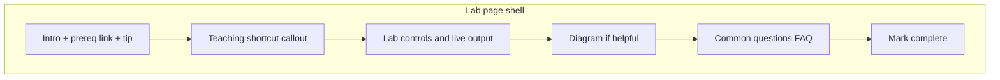
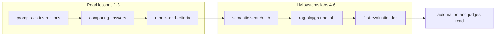

# Align all Learn labs to NN lab Q&A pattern

## What “Q&A pattern” means here

For **interactive labs**, the learn-hub skill does **not** use read-lesson `app-learn-check-question` gating. The reference is the **Neural network lab** shell in [`nn-playground.html`](src/app/pages/nn-playground/nn-playground.html):

| Layer                | NN lab today                                              | Purpose                                                                                      |
| -------------------- | --------------------------------------------------------- | -------------------------------------------------------------------------------------------- |
| Intro                | Lead analogy + muted “how to use” + **Tip** starting task | Orient before touching controls                                                              |
| Prerequisite bridge  | _(missing today)_                                         | Link to the read lesson or prior lab named in [`curriculum.ts`](src/app/learn/curriculum.ts) |
| Honesty callout      | Implicit (flash cards, softmax note)                      | State teaching shortcuts vs production                                                       |
| Interactive UI       | Controls + live feedback                                  | Hands-on learning                                                                            |
| Diagrams             | None                                                      | Visual aid where concepts are spatial or sequential                                          |
| **Common questions** | `<details>` FAQ block (lines 389–423)                     | Collapsible Q&A for traps learners hit while experimenting                                   |
| Footer               | `learn-lab-footer` + Mark complete                        | Progress via `LearnProgressService`                                                          |



---

## Mini-plan: LLM systems labs (3 labs)

The **LLM systems** track has three labs in sequence — all three are in scope and share the same teaching shell as the NN lab. They are **not** separate from the main plan; this section is the track-specific rollout.

### Track context (what the learner already knows)

Before lab 4, the learner completes three read lessons:

| Order | Lesson                  | Sets up                        |
| ----- | ----------------------- | ------------------------------ |
| 1     | Prompts as instructions | LLMs follow wording            |
| 2     | Comparing answers       | Same prompt, pick a winner     |
| 3     | Rubrics and criteria    | Scorable criteria with anchors |

Labs 4–6 apply that eval mindset to **retrieval** and then **real AiEval tooling**. Lab 7 read lesson (_Automation and judges_) follows — each lab’s honesty callout and FAQ should **name that next lesson** where relevant.



### Lab-by-lab teaching arc

| Lab                  | Route                          | Kind             | Prerequisite link in intro                                  | Diagram                                                     | Bridge forward                                              |
| -------------------- | ------------------------------ | ---------------- | ----------------------------------------------------------- | ----------------------------------------------------------- | ----------------------------------------------------------- |
| **Semantic search**  | `/learn/labs/semantic-search`  | interactive      | [Rubrics and criteria](/learn/lessons/rubrics-and-criteria) | **Keep** 2D vector map                                      | “Next: RAG playground — assemble chunks into a prompt”      |
| **RAG playground**   | `/learn/labs/rag-playground`   | interactive      | [Semantic search lab](/learn/labs/semantic-search)          | **Add** pipeline SVG (retrieve → context → prompt → answer) | “Next: First evaluation lab — score real answers in AiEval” |
| **First evaluation** | `/learn/labs/first-evaluation` | tool walkthrough | [RAG playground](/learn/labs/rag-playground)                | **Add** Create → Automate → Dashboard → Compare flow        | “Next: Automation and judges — when to trust AI scores”     |

### Shared engine (both retrieval labs)

Semantic search and RAG use the same client-side stack — FAQ copy should stay consistent:

| File                                                                     | Role                                                                                               |
| ------------------------------------------------------------------------ | -------------------------------------------------------------------------------------------------- |
| [`corpus.ts`](src/app/utils/retrieval/corpus.ts)                         | `TEACHING_CORPUS` — eval/RAG-themed chunks, 2D vectors                                             |
| [`similarity.ts`](src/app/utils/retrieval/similarity.ts)                 | `rankByQuery`, cosine scoring                                                                      |
| [`context.ts`](src/app/utils/retrieval/context.ts)                       | Character budget assembly (RAG only)                                                               |
| [`stub-generate.ts`](src/app/utils/retrieval/stub-generate.ts)           | Extractive stub answer (RAG only)                                                                  |
| [`retrieval-glossary.ts`](src/app/utils/retrieval/retrieval-glossary.ts) | Term hints — use `embedding`, `cosineSimilarity`, `topK`, `rag`, `contextWindow` across both pages |

No engine changes in this work — only page shells and copy.

### Track-specific intro pattern (all 3 labs)

Each LLM systems lab page header should show:

```
LLM systems · Lab N of 6   ← already rendered via trackLabel + trackLabCount
```

Plus these four blocks (matching NN lab):

1. **Lead** — one concrete analogy tied to eval/RAG (open-book exam, research assistant, etc.)
2. **Prerequisite bridge** — link to immediate prereq from `curriculum.ts` (not all three read lessons — just the direct parent)
3. **Tip** — one hands-on starting task using existing controls/presets
4. **Honesty callout** — teaching shortcut vs production (2D vectors, stub LLM, AI judges)

### FAQ themes per lab (track progression)

Questions should reinforce the **chain**, not repeat the same four answers:

**Semantic search** — “how do I find the right text?”

- Keyword vs semantic, cosine meaning, top-k purpose, 2D map limitation

**RAG playground** — “what do I do with retrieved text?”

- Bad retrieval, context budget, stub vs LLM, when to evaluate in AiEval

**First evaluation** — “how do I judge model answers in the product?”

- Empty create form OK, what automation does, dashboard highlight/handoff, what to inspect on Compare

### Cross-lab “Next / Review” links

Already partially present; unify placement **above Common questions** (same slot on every lab):

| Lab              | Review link         | Next link                           |
| ---------------- | ------------------- | ----------------------------------- |
| Semantic search  | —                   | RAG playground                      |
| RAG              | Semantic search lab | First evaluation lab                |
| First evaluation | RAG playground      | Automation and judges (read lesson) |

### LLM systems implementation order

Do these **back-to-back** after shared FAQ CSS (step 1 of main plan):

1. **Semantic search** — FAQ + intro shell; preserve `.retrieval-plot`
2. **RAG** — FAQ + intro + pipeline SVG; wire `topK` glossary on retrieve control
3. **First evaluation** — intro + FAQ + flow SVG; keep JSON steps unchanged; add bridge to _Automation and judges_

Then run LLM-specific tests in one pass:

```bash
npm test -- src/app/pages/semantic-search-lab/semantic-search-lab.spec.ts src/app/pages/rag-playground/rag-playground.spec.ts src/app/pages/learn-walkthrough-page/learn-walkthrough-page.spec.ts
```

Foundation NN lab polish (step 5 of main plan) can happen before or after the LLM batch — no dependency either way.

---

## Gap analysis (current state)

### Neural network lab — reference, minor gaps

- Has: intro, glossary hints, XOR tip, FAQ (4 items), mark complete
- Missing vs criteria: explicit link to prerequisite [`loss-and-updates`](src/app/learn/curriculum.ts) (`/learn/lessons/loss-and-updates`); explicit honesty about **no train/test split** and **toy 2-input network**
- Optional diagram: simple **architecture SVG** (2 inputs → hidden layer → output) to complement the FAQ on hidden layers

### Semantic search lab — partial

- Has: intro, glossary hints, **2D plot** (keep as-is), mark complete, brief 2D disclaimer
- Missing: prereq link to [`rubrics-and-criteria`](src/app/learn/curriculum.ts), framed starting tip, expanded honesty callout, **Common questions** section
- Diagram: **keep** [`retrieval-plot`](src/app/pages/semantic-search-lab/semantic-search-lab.html); optionally add faint axis labels or query→match dashed lines in the same SVG (no new widget)

### RAG playground — thinnest shell

- Has: intro, two glossary hints, 4-step UI, stub-answer honesty, back-links
- Missing: prereq link to semantic search lab, starting tip, **Common questions**, **flow diagram**
- Diagram: add inline **RAG pipeline SVG** (Query → Retrieve → Assemble context → Prompt → Answer) above the numbered sections — mirrors how semantic search visualizes vector space

### First evaluation lab (tool walkthrough) — different kind, same shell

- Has: 4 steps in [`first-evaluation-lab.json`](src/app/learn/content/first-evaluation-lab.json), handoff via `?from=learn`
- Missing: expanded intro, prereq link to RAG lab, **Common questions**, optional **flow diagram** (Create → Automate → Dashboard → Compare)
- Keep step list as primary interaction; FAQ supplements it (does not replace steps)

---

## Shared styling (one small refactor)

Today FAQ styles live only in [`nn-playground.css`](src/app/pages/nn-playground/nn-playground.css) as `.nn-faq`.

1. Move/rename to shared **`.learn-lab-faq`** + **`.learn-lab-faq__question`** in [`styles.css`](src/styles.css) (alongside existing design tokens)
2. Update NN lab template to use the shared class names
3. Reuse the same classes in semantic search, RAG, and walkthrough templates

Also unify footer copy to **“Mark lab complete” / “Lab completed”** (semantic search and RAG currently say “Mark complete” / “Completed”).

Optional: move duplicated `.learn-back-link` rules into `styles.css` while touching lab CSS — low cost, reduces drift.

---

## Content to add per lab

### 1. Neural network lab ([`nn-playground.html`](src/app/pages/nn-playground/nn-playground.html))

**Intro additions**

- After lead: “Builds on [Loss and updates](/learn/lessons/loss-and-updates) — you already saw how wrong guesses become weight nudges.”
- Honesty alert (Bootstrap `alert-light`): this lab trains on **all rows with no held-out test set**; real projects keep test data separate.

**Diagram (new, simple SVG)**

- Static 3-box diagram: `x1, x2` → `hidden` → `output` with one sentence caption

**FAQ** — keep existing 4; no change needed unless adding one on train/test after honesty callout

---

### 2. Semantic search lab ([`semantic-search-lab.html`](src/app/pages/semantic-search-lab/semantic-search-lab.html))

**Intro additions**

- Prereq: link to [Rubrics and criteria](/learn/lessons/rubrics-and-criteria)
- Tip: “Start with the **evaluation rubric** preset — watch which chunks rank highest and why.”
- Honesty: expand the existing 2D note into a visible callout — real embeddings use **hundreds/thousands of dimensions**; this lab uses **2D** so you can _see_ closeness on the map

**Diagram** — **keep** existing plot; minor enhancement only if it stays readable (labels “dim 1 / dim 2”)

**Common questions** (4 `<details>`, first open)

1. _How is this different from keyword search?_ — matches meaning, not exact words
2. _What does cosine similarity measure?_ — angle between vectors; 1 = same direction
3. _Why use top-k?_ — models cannot read the whole corpus; retrieval narrows the field
4. _Why is my query dot red but far from a blue match?_ — 2D teaching simplification; real space is higher-dimensional

---

### 3. RAG playground ([`rag-playground.html`](src/app/pages/rag-playground/rag-playground.html))

**Intro additions**

- Prereq: link to [Semantic search lab](/learn/labs/semantic-search)
- Tip: “Try the default question, then **uncheck a retrieved chunk** and watch the stub answer change.”
- Honesty callout: stub answer is **extractive**, not generative; production sends the prompt preview to an LLM

**Diagram (new SVG)** — horizontal pipeline before section “1. Retrieve”:

```
[Question] → [Top-k chunks] → [Context block] → [Prompt] → [Answer]
```

Style consistently with semantic search plot (border, `var(--bs-border-color)`, aria-label)

**Common questions** (4 items)

1. _What if retrieval returns the wrong chunks?_ — garbage in, garbage out; evaluate retrieval in AiEval
2. _Why a character budget?_ — context window limit; must trim or rank
3. _Why a stub instead of calling a model?_ — isolates retrieval/prompt assembly without API keys
4. _How do I know if my RAG setup is good?_ — bridge to First evaluation lab / AiEval compare

Add missing glossary hints where natural: `topK` on retrieve control, `cosineSimilarity` in FAQ or intro (terms already in [`retrieval-glossary.ts`](src/app/utils/retrieval/retrieval-glossary.ts))

---

### 4. First evaluation lab ([`learn-walkthrough-page.html`](src/app/pages/learn-walkthrough-page/learn-walkthrough-page.html))

**Intro additions** (before step list)

- Lead paragraph: what you will do in AiEval (create, automate, compare)
- Prereq: link to [RAG playground](/learn/labs/rag-playground) — you saw retrieval; now evaluate model answers
- Honesty: automation uses AI judges; you will learn when to double-check in the next read lesson

**Diagram (new SVG)** — 4-step horizontal flow matching existing JSON steps

**Common questions** (4 items)

1. _Do I need to fill in title and prompt?_ — no for first run; automation can draft them
2. _What does Run full automation do?_ — generate, score, draft improved answer
3. _Why is my evaluation highlighted on the dashboard?_ — `?from=learn` handoff via [`learn-handoff.service.ts`](src/app/learn/learn-handoff.service.ts)
4. _What should I look for on Compare?_ — rubric scores, winner, whether answers match criteria

Align back link class to `learn-back-link` for consistency with other labs.

---

## TypeScript changes (minimal)

Each lab page already calls `getLesson(...)`. Add a small computed/getter pattern for prerequisite metadata:

```typescript
readonly prereqMeta = getLesson(this.labMeta?.prerequisites[0] ?? '');
```

Use `prereqMeta?.title` and `prereqMeta?.route` in templates — no new curriculum helpers required.

Walkthrough page: same pattern with `first-evaluation-lab` meta.

---

## Tests to update

| Spec                                                                                                    | New assertion                                     |
| ------------------------------------------------------------------------------------------------------- | ------------------------------------------------- |
| [`semantic-search-lab.spec.ts`](src/app/pages/semantic-search-lab/semantic-search-lab.spec.ts)          | `Common questions` heading; plot still present    |
| [`rag-playground.spec.ts`](src/app/pages/rag-playground/rag-playground.spec.ts)                         | FAQ section; pipeline diagram aria-label or class |
| [`learn-walkthrough-page.spec.ts`](src/app/pages/learn-walkthrough-page/learn-walkthrough-page.spec.ts) | FAQ + intro prereq link                           |
| NN playground spec (if exists)                                                                          | Shared FAQ class still renders                    |

Run:

```bash
npm test -- src/app/pages/semantic-search-lab/semantic-search-lab.spec.ts src/app/pages/rag-playground/rag-playground.spec.ts src/app/pages/learn-walkthrough-page/learn-walkthrough-page.spec.ts
```

---

## Out of scope (keeps diff focused)

- No new Angular FAQ component (inline `<details>` matches NN lab; skill says avoid new widgets when HTML suffices)
- No JSON schema change for walkthrough FAQ (content stays in template unless you later want CMS-style FAQ in JSON)
- No changes to read-lesson check-yourself flow
- No engine/math changes under `utils/nn` or `utils/retrieval`

---

## Implementation order

1. Extract shared `.learn-lab-faq` CSS; update NN lab class names
2. **LLM systems batch** (see mini-plan above):
   - Semantic search — full shell; keep 2D plot
   - RAG — shell + pipeline diagram
   - First evaluation — intro + FAQ + flow diagram + bridge to _Automation and judges_
3. NN lab (Foundation) — prereq link, honesty, optional architecture diagram
4. Spec updates + smoke-test in browser (reveals open/close, diagrams render, mark complete still works)
