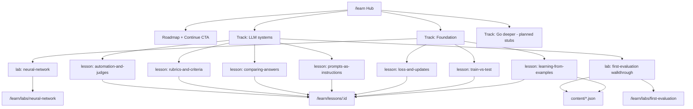

# Learn curriculum hub

## Goals

- Replace the flat topic picker on [`learn-page`](src/app/pages/learn-page/learn-page.html) with a **roadmap + tracks** hub aligned to foundation-first AI engineering.
- Ship a **curriculum shell** (routes, progress, navigation, empty-state rendering) — **not** full lesson prose in this build.
- Relocate the NN playground under **`/learn/labs/neural-network`** (keep old URL as redirect).
- Keep AiEval evaluation routes (`/`, `/evaluations/*`) unchanged — linked from walkthrough content files, not hardcoded lesson copy in components.

## Content strategy (no prose in pages)

**Agreed approach:** Pages and components are **render-only shells**. All teachable text lives in external files you edit over time.

| Layer                                                    | Holds                                                                                                | Does not hold                                       |
| -------------------------------------------------------- | ---------------------------------------------------------------------------------------------------- | --------------------------------------------------- |
| [`curriculum.ts`](src/app/learn/curriculum.ts)           | ids, track, order, kind, status, route, prerequisites, **title + one-line summary** (catalog labels) | Lesson sections, check questions, walkthrough steps |
| [`src/app/learn/content/*.json`](src/app/learn/content/) | `sections`, `checkQuestions`, walkthrough `steps`                                                    | Routing or progress logic                           |
| Page templates (`.html`)                                 | Structure, bindings, UI chrome (“Back”, “Mark complete”)                                             | Paragraphs, examples, explanations                  |

**Initial content files:** one JSON stub per live lesson/lab with empty `sections` / `steps`. Lesson page shows a neutral **“Content coming soon”** empty state when `sections.length === 0`. **Mark complete** is disabled until at least one section exists (prevents gaming an empty curriculum).

**Hub copy:** subtitle and track descriptions come from a single [`src/app/learn/content/hub.json`](src/app/learn/content/hub.json) (or `HUB_COPY` constant in `curriculum.ts` — max 3 short strings). No marketing paragraphs in `learn-page.html`.

**NN playground:** existing teaching copy stays as-is (pre-existing interactive lab). This build only adds navigation/progress chrome, not new lesson prose.

**Loading:** [`src/app/learn/learn-content.ts`](src/app/learn/learn-content.ts) exports `loadLessonContent(lessonId)` and `loadWalkthroughContent()` — static imports of JSON files (no runtime HTTP). Type-safe `LessonContent` / `WalkthroughContent` interfaces shared with JSON shape.

```typescript
// curriculum.ts — metadata only
export interface LearnLessonMeta {
  id: string;
  trackId: LearnTrackId;
  order: number;
  title: string;
  summary: string; // one line for hub cards
  kind: LessonKind;
  status: LessonStatus;
  prerequisites: string[];
  route: string;
  contentFile: string; // e.g. 'learning-from-examples.json'
}

// content/*.json — you write this later
export interface LessonContent {
  sections: { heading?: string; paragraphs: string[] }[];
  checkQuestions: { prompt: string; answer: string }[];
}

export interface WalkthroughContent {
  steps: {
    title: string;
    body: string;
    actionLabel: string;
    actionRoute: string;
  }[];
}
```

## Flow inspection (preflight + postflight)

**Before implementation:** run **flow-inspector** on the planned learner journey (user attached skill). Fix plan-level issues; do not start coding until verdict is not blocked.

**After implementation:** re-run flow-inspector on the built flow; address any **Critical** findings before handoff.

### Preflight findings (plan-time)

**Bucket:** code_flow  
**Anchor:** `/learn` hub → lesson/lab routes → `LearnProgressService` → AiEval tool routes

| Severity | Issue                                                                                                                                                                                | Plan mitigation                                                                                                                                             |
| -------- | ------------------------------------------------------------------------------------------------------------------------------------------------------------------------------------ | ----------------------------------------------------------------------------------------------------------------------------------------------------------- |
| Warning  | Walkthrough steps 4–5 link to `/` dashboard with no eval id — learner may not find their evaluation                                                                                  | Walkthrough JSON (when written) should say “open your evaluation from the dashboard”; optional future: `?from=learn` banner on dashboard — out of scope now |
| Warning  | `localStorage` completed ids can go stale if curriculum ids change                                                                                                                   | `LearnProgressService` filters to known ids from `curriculum.ts` only                                                                                       |
| Warning  | Labs open while reads locked — **Continue** CTA must use `getNextLesson` which skips completed and respects **read-before-lab order**, not “first incomplete including labs skipped” | `getNextLesson`: walk foundation reads 1→3, then labs only if all prior reads in track complete; same for llm-systems reads before `first-evaluation-lab`   |
| Info     | Empty content + disabled Mark complete — hub progress stays at 0 until you add JSON                                                                                                  | Intentional; roadmap still navigates via track list                                                                                                         |

**Verdict:** Proceed to implementation (0 critical).

**Next skill:** implementation per this plan; optional maintainer doc in `aieval-learn-hub` after ship.

## Information architecture



## Route changes

| Path                           | Component                    | Notes                                 |
| ------------------------------ | ---------------------------- | ------------------------------------- |
| `/learn`                       | `LearnPage` (refactor)       | Hub: roadmap, tracks, tools strip     |
| `/learn/lessons/:lessonId`     | `LearnLessonPage` (new)      | Shell; loads JSON by meta.contentFile |
| `/learn/labs/neural-network`   | `NnPlaygroundPage`           | Canonical NN lab URL                  |
| `/learn/labs/first-evaluation` | `LearnWalkthroughPage` (new) | Shell; loads walkthrough JSON         |
| `/learn/neural-network`        | redirect                     | → `/learn/labs/neural-network`        |

Update [`app.routes.ts`](src/app/app.routes.ts) accordingly.

## Curriculum metadata catalog

**Foundation** (start here)

| id                       | kind        | route                                   | content file                  |
| ------------------------ | ----------- | --------------------------------------- | ----------------------------- |
| `learning-from-examples` | read        | `/learn/lessons/learning-from-examples` | `learning-from-examples.json` |
| `train-vs-test`          | read        | `/learn/lessons/train-vs-test`          | `train-vs-test.json`          |
| `loss-and-updates`       | read        | `/learn/lessons/loss-and-updates`       | `loss-and-updates.json`       |
| `neural-network-lab`     | interactive | `/learn/labs/neural-network`            | _(none — interactive lab)_    |

**LLM systems**

| id                        | kind | route                                    | content file                   |
| ------------------------- | ---- | ---------------------------------------- | ------------------------------ |
| `prompts-as-instructions` | read | `/learn/lessons/prompts-as-instructions` | `prompts-as-instructions.json` |
| `comparing-answers`       | read | `/learn/lessons/comparing-answers`       | `comparing-answers.json`       |
| `rubrics-and-criteria`    | read | `/learn/lessons/rubrics-and-criteria`    | `rubrics-and-criteria.json`    |
| `first-evaluation-lab`    | tool | `/learn/labs/first-evaluation`           | `first-evaluation-lab.json`    |
| `automation-and-judges`   | read | `/learn/lessons/automation-and-judges`   | `automation-and-judges.json`   |

**Go deeper** — 2–3 `planned` placeholder entries in metadata only; no routes or content files yet.

Helpers in `curriculum.ts`:

- `getTrack`, `getLesson`, `getLessonsForTrack`
- `getNextLesson(completedIds)` — foundation reads 1→3, then `neural-network-lab`; llm reads 1→3, then `first-evaluation-lab`, then `automation-and-judges`; skips `planned`
- `validateCurriculum()` — ids, prerequisites, contentFile references, order

## Progress tracking

[`src/app/learn/learn-progress.service.ts`](src/app/learn/learn-progress.service.ts):

- `localStorage` key: `aieval-learn-progress` → `string[]`
- Filter reads/writes to ids present in `curriculum.ts` (ignore unknown stale ids)
- Read lessons: **Mark complete** enabled only when content has `sections.length > 0`
- Labs: **Mark complete** always available (NN playground, walkthrough shell once `steps.length > 0`; disabled when walkthrough JSON empty)
- Roadmap **Continue** → `getNextLesson(completedIds)`

## New / updated UI (shells only)

### Hub — refactor [`learn-page`](src/app/pages/learn-page/)

1. **Roadmap** — progress over live lessons with content OR completed labs; **Continue** CTA
2. **Tracks** — lists from curriculum metadata (title + summary binding only)
3. **Tools** — link to `/evaluations/new` (label from `hub.json`)
4. **Go deeper** — planned stubs from metadata

Components: [`learn-roadmap`](src/app/components/learn-roadmap/), [`learn-track-list`](src/app/components/learn-track-list/).

**Locked state:** reads disabled when prereqs incomplete; labs navigable but listed with prereq hint from metadata.

### Read lesson page — [`learn-lesson-page`](src/app/pages/learn-lesson-page/)

- Resolve meta from `:lessonId`; load JSON via `loadLessonContent`
- Render sections / check questions from JSON; empty state if no sections
- Prev/next footer from track order; **Mark complete** per rules above

### Walkthrough page — [`learn-walkthrough-page`](src/app/pages/learn-walkthrough-page/)

- Load `first-evaluation-lab.json` steps; render list-group + action buttons from data
- Empty state when `steps.length === 0`
- **Mark complete** when steps exist

### NN playground — [`nn-playground.html`](src/app/pages/nn-playground/nn-playground.html)

- Back link → `/learn`
- Lab position label from curriculum (`neural-network-lab` order/title)
- **Mark complete** footer → progress service for `neural-network-lab`

## File map

| File                                      | Purpose                                     |
| ----------------------------------------- | ------------------------------------------- |
| `src/app/learn/curriculum.ts`             | Metadata, helpers, validation               |
| `src/app/learn/learn-content.ts`          | Types + JSON loaders                        |
| `src/app/learn/content/*.json`            | Lesson/walkthrough bodies (stubs initially) |
| `src/app/learn/content/hub.json`          | Hub subtitle + tool strip label             |
| `src/app/learn/curriculum.spec.ts`        | Validation + `getNextLesson`                |
| `src/app/learn/learn-progress.service.ts` | Progress                                    |
| `src/app/pages/learn-lesson-page/*`       | Read shell                                  |
| `src/app/pages/learn-walkthrough-page/*`  | Walkthrough shell                           |
| `src/app/components/learn-roadmap/*`      | Hub roadmap                                 |
| `src/app/components/learn-track-list/*`   | Track lists                                 |

## Testing

- `curriculum.spec.ts` — graph validity, next-lesson order (reads before labs), content file map
- `learn-progress.service.spec.ts` — stale id filtering, mark complete
- `learn-lesson-page.spec.ts` — renders empty state for stub JSON; redirects bad id
- `learn-walkthrough-page.spec.ts` — empty state + step binding when JSON populated in test fixture

Run `npm test`.

## Docs / skills

- Update [`.cursor/skills/aieval-nn-playground/SKILL.md`](.cursor/skills/aieval-nn-playground/SKILL.md) routes
- Add [`.cursor/skills/aieval-learn-hub/SKILL.md`](.cursor/skills/aieval-learn-hub/SKILL.md) — curriculum vs `content/` split, how to add a lesson (meta + JSON file)

## Out of scope

- Writing full lesson prose (you add JSON over time)
- Go deeper lesson pages
- Markdown pipeline / CMS
- Auth-backed progress
- Dashboard `?from=learn` banner
- Create-page query-param guided mode

## Implementation order

1. **Flow-inspector preflight** — confirm plan mitigations; proceed if not blocked
2. `curriculum.ts` + `learn-content.ts` + empty JSON stubs + `curriculum.spec.ts`
3. `LearnProgressService` + tests
4. Routes + `LearnLessonPage` + `LearnWalkthroughPage`
5. Hub components; refactor `LearnPage`
6. NN playground navigation + mark complete; route redirect
7. Component specs; `npm test`
8. **Flow-inspector postflight** — fix critical issues if any

## Adding content later (your workflow)

1. Add or edit `src/app/learn/content/{id}.json` — sections and check questions
2. For a new lesson: add row to `curriculum.ts` + new JSON file (no page changes if route pattern matches)
3. Refresh `/learn/lessons/:id` — shell renders new text automatically
