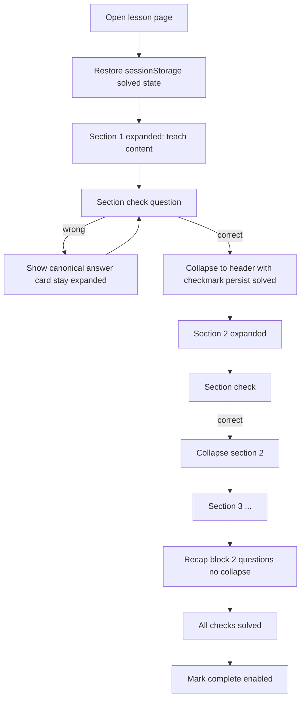

# Lesson section Q&A redesign

## Required fixes (from flow inspection)

These are **mandatory** in this pass — not optional hardening.

### Fix 1 — Mark complete bypass

**Problem:** [`learn-progress.service.ts:37-45`](src/app/learn/learn-progress.service.ts) enables Mark complete when `sections.length > 0` only. Learners skip all questions today.

**Fix:**

- Add page-level `allChecksSolved()` on [`learn-lesson-page.ts`](src/app/pages/learn-lesson-page/learn-lesson-page.ts): every `section.check` + every `recapQuestions[]` entry must be `solved`.
- Disable Mark complete button until true; show muted helper: _"Answer all section checks and recap questions first."_
- Do **not** change `LearnProgressService.markComplete` itself — gating stays on the lesson page where session state lives.
- Update [`learn-lesson-page.spec.ts`](src/app/pages/learn-lesson-page/learn-lesson-page.spec.ts): button disabled before solves, enabled after.

### Fix 2 — Ephemeral in-lesson state

**Problem:** Section solved/collapsed state is component memory only; refresh mid-lesson resets everything.

**Fix:** New [`learn-lesson-session.service.ts`](src/app/learn/learn-lesson-session.service.ts):

- `sessionStorage` key: `aieval-learn-lesson-{lessonId}`
- Shape: `{ sectionsSolved: boolean[], recapSolved: boolean[], collapsed: boolean[] }`
- Read on init; write on each `solvedChange`
- Clear when lesson marked complete in `LearnProgressService` (optional cleanup)
- Pattern mirrors [`learn-handoff.service.ts`](src/app/learn/learn-handoff.service.ts) (session-scoped, not localStorage)

### Fix 3 — Check question state machine

**Problem:** [`learn-check-question.ts`](src/app/components/learn-check-question/learn-check-question.ts) uses `checked`/`isCorrect` only — no durable `solved` state; collapse trigger undefined.

**Fix:**
| State | UI |
|-------|-----|
| Unanswered | Interactive MC or text input |
| Wrong | Canonical answer card (current behavior) + inputs stay active for retry |
| Correct (first time) | Brief success → emit `solvedChange(true)` → parent collapses section |
| Solved + readonly | Show selected answer, no Check button |
| Solved + reopened | Show readonly check + **Why this answer** card (`explanation` field) |

New inputs/outputs: `solved`, `readonly`, `showExplanation`, `solvedChange`.

### Fix 4 — Schema migration without breaking stubs

**Problem:** 9 stub lessons use top-level `checkQuestions: []`; moving checks inline could break loaders.

**Fix:**

- `LessonSection.check` optional in TypeScript; **required** only for live lessons with `sections.length > 0` (enforced in `validateLessonContent()`)
- Add `recapQuestions: []` to all stub JSON files
- Remove top-level `checkQuestions` from the 2 rewritten lessons; stubs keep `checkQuestions: []` until migrated
- [`lessonHasBody()`](src/app/learn/learn-content.ts) unchanged (still `sections.length > 0`)

### Fix 5 — Content depth validation

**Problem:** No CI guard for empty explanations or missing section checks on live lessons.

**Fix:** New [`learn-content.spec.ts`](src/app/learn/learn-content.spec.ts):

- For each live read lesson with sections: every section has `check` with `prompt`, `answer`, `explanation`
- `recapQuestions.length === 2` for the 2 rewritten lessons
- Fails build if `explanation` is empty string

### Fix 6 — Remove duplicate question UI

**Problem:** Current [`learn-lesson-page.html:77-88`](src/app/pages/learn-lesson-page/learn-lesson-page.html) renders a separate "Check yourself" block at the bottom — conflicts with per-section + recap model.

**Fix:** Delete bottom `checkQuestions` loop entirely. Recap uses its own heading: **"Recap"**.

### Fix 7 — Term hint spacing in expanded content

**Problem:** `{{term}}` glued to suffixes (`s`, `,`) caused visual gaps (already patched in [`learn-lesson-text.html`](src/app/components/learn-lesson-text/learn-lesson-text.html)).

**Fix when authoring:** Use natural prose (`inputs`, `train set,`) not `{{input}}s`. Document in skill. No further code change needed unless regression found.

---

## Flow inspection summary

**Bucket:** code_flow  
**Anchor:** `LearnLessonPage` → `LearnProgressService`  
**Verdict:** Proceed — fixes 1–6 above address all Warning findings.

---

## Target learner flow



**Collapsed header:** section title + green check badge. Click toggles open.

**Reopened after correct:** teach content + readonly question + **Why this answer** (`explanation`, 2–4 sentences).

**Recap:** 2 MC questions at bottom; wrong → canonical answer card; correct → inline `explanation`. No collapse.

**Wrong answer (user choice):** show canonical answer, stay expanded, retry until correct.

---

## JSON schema

Update [`learn-content.ts`](src/app/learn/learn-content.ts):

```ts
export interface CheckQuestion {
  prompt: string;
  answer: string;
  accept?: string[];
  choices?: string[];
  explanation: string;
}

export interface LessonSection {
  title?: string;
  paragraphs: string[];
  bullets?: string[];
  reveals?: LessonReveal[];
  check?: CheckQuestion;
}

export interface LessonContent {
  sections: LessonSection[];
  recapQuestions: CheckQuestion[];
  checkQuestions?: CheckQuestion[]; // legacy stubs only
}
```

**Content targets (lessons 1–2):**

- 4–5 paragraphs per section before the check
- 1 MC `check` per section with `explanation`
- 2 `recapQuestions` synthesizing the full lesson
- All jargon via `{{termKey}}` in [`learn-glossary.ts`](src/app/learn/learn-glossary.ts)

---

## UI components

### `learn-lesson-section` (new)

[`src/app/components/learn-lesson-section/`](src/app/components/learn-lesson-section/)

- Renders teach content + embedded check
- Restores `solved`/`collapsed` from session service
- On `solvedChange(true)`: collapse after success flash; persist session

### `learn-check-question` (evolve)

See Fix 3 state table above.

### `learn-lesson-page` (rewire)

See Fixes 1, 2, 6 above.

---

## Content rewrite scope

| File                                                                               | Sections | Section checks          | Recap |
| ---------------------------------------------------------------------------------- | -------- | ----------------------- | ----- |
| [`learning-from-examples.json`](src/app/learn/content/learning-from-examples.json) | 3        | 3 MC + explanation each | 2 MC  |
| [`train-vs-test.json`](src/app/learn/content/train-vs-test.json)                   | 3        | 3 MC + explanation each | 2 MC  |

Stubs: add `"recapQuestions": []` only — no prose work.

---

## Tests

| Spec                                   | Asserts                                                              |
| -------------------------------------- | -------------------------------------------------------------------- |
| `learn-lesson-session.service.spec.ts` | persist/restore solved arrays                                        |
| `learn-check-question.spec.ts`         | wrong shows answer; correct emits solved; readonly shows explanation |
| `learn-lesson-section.spec.ts`         | collapse on correct; reopen shows explanation                        |
| `learn-lesson-page.spec.ts`            | mark complete gated; recap renders; no legacy Check yourself block   |
| `learn-content.spec.ts`                | live lessons with sections pass depth validation                     |

---

## Skill doc

Update [`aieval-learn-hub/SKILL.md`](.cursor/skills/aieval-learn-hub/SKILL.md):

- Per-section `check` + required `explanation`
- `recapQuestions` (2)
- 4–5 paragraphs before each check
- Collapse-on-correct UX
- No `{{term}}suffix` in JSON

---

## Out of scope

- Rewriting stub lesson prose
- Sequential section lock (section 2 hidden until section 1 solved)
- Cross-session persistence (sessionStorage only, not localStorage)
