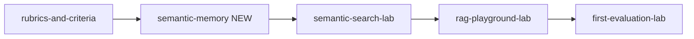

# Semantic memory read lesson

## Placement and curriculum ripple

Insert **`semantic-memory`** at **order 4** in the `llm-systems` track, shifting later items by +1:



| Lesson                  | Change                                                                                                                                                                  |
| ----------------------- | ----------------------------------------------------------------------------------------------------------------------------------------------------------------------- |
| `semantic-memory`       | **New** — `kind: 'read'`, `status: 'live'`, `prerequisites: ['rubrics-and-criteria']`, `route: '/learn/lessons/semantic-memory'`, `contentFile: 'semantic-memory.json'` |
| `semantic-search-lab`   | `order: 5`, `prerequisites: ['semantic-memory']` (was `rubrics-and-criteria`)                                                                                           |
| `rag-playground-lab`    | `order: 6`                                                                                                                                                              |
| `first-evaluation-lab`  | `order: 7`                                                                                                                                                              |
| `automation-and-judges` | `order: 8`                                                                                                                                                              |

Edit [`src/app/learn/curriculum.ts`](src/app/learn/curriculum.ts) only — no new route needed (existing `/learn/lessons/:lessonId` shell handles it).

## Glossary terms (read lessons)

Extend [`src/app/learn/learn-glossary.ts`](src/app/learn/learn-glossary.ts) with terms used in the JSON (labs keep their separate [`retrieval-glossary.ts`](src/app/utils/retrieval/retrieval-glossary.ts)):

| Term key         | Purpose in lesson                                         |
| ---------------- | --------------------------------------------------------- |
| `semanticMemory` | Facts stored outside the live prompt, fetched when needed |
| `contextWindow`  | Fixed token limit per request                             |
| `embedding`      | Numeric meaning representation of text                    |
| `retrieval`      | Fetching relevant stored passages for a query             |
| `chunk`          | Small slice of source text indexed for search             |

## Lesson content

Create [`src/app/learn/content/semantic-memory.json`](src/app/learn/content/semantic-memory.json) following the learn-hub authoring checklist.

**Title / takeaway:** Store knowledge outside the model and pull the right facts by meaning — not by pasting everything into every prompt.

**`summary` in curriculum:** e.g. _"Store knowledge outside the model and fetch the right passages by meaning."_

### Section 1 — Memory beyond the prompt (concept)

- **Analogy:** open-book exam with a indexed notebook vs trying to memorize the whole textbook in your head.
- Contrast **in-prompt context** (limited by `{{contextWindow}}`) with **`{{semanticMemory}}`** — a durable store of facts/docs you search at query time.
- Honest note: weights hold broad patterns, not a reliable filing cabinet for every company fact.
- **AiEval tie-in:** comparing model answers about internal policy when the model was never trained on that doc.
- **Check (spot the trap):** MC — team pastes entire 200-page handbook into every system prompt vs indexing chunks in a vector store.

### Section 2 — Search by meaning (practice)

- Docs split into **`{{chunk}}`s** → **`{{embedding}}`s** → similarity search at query time.
- **`{{retrieval}}`** beats keyword grep when wording differs ("password reset" vs "recover account access").
- **2–4 `reveals`** with short scenarios (support FAQ, eval rubric doc, API reference).
- **Check (apply):** MC — pick semantic search over Ctrl+F for a paraphrased user question.

### Section 3 — Bridge forward

- Name **Semantic search lab** explicitly and why it follows (hands-on ranking in 2D).
- Honest shortcuts: real systems use high-dimensional embeddings, hybrid keyword+semantic search, metadata filters.
- Brief preview that **RAG playground** will assemble retrieved chunks into a prompt.
- **Check (summarize):** free-text — short phrase like _"external memory retrieved by meaning"_ with 3–5 `accept` aliases.

### Recap

- **2 `recapQuestions`** synthesizing context limits + retrieval (both with `explanation`).

Register in [`src/app/learn/learn-content.ts`](src/app/learn/learn-content.ts): import JSON, add to `LESSON_CONTENT`, optionally add `'semantic-memory'` to `FULL_RECAP_LESSON_IDS` so recap count is validated like foundation lessons.

## Lab copy alignment

Update the hardcoded prereq bridge in [`src/app/pages/semantic-search-lab/semantic-search-lab.html`](src/app/pages/semantic-search-lab/semantic-search-lab.html) (lines 20–21) — it still says _"scorable criteria"_ but `prereqMeta` will point at Semantic memory:

```html
Builds on … — you saw why facts live outside the prompt and how {{embedding}}s
enable retrieval.
```

(Use `app-retrieval-term-hint` for embedding here, matching other lab pages.)

## Tests to update

| File                                                                                                                             | Change                                                                                       |
| -------------------------------------------------------------------------------------------------------------------------------- | -------------------------------------------------------------------------------------------- |
| [`src/app/learn/curriculum.spec.ts`](src/app/learn/curriculum.spec.ts)                                                           | Add `'semantic-memory'` to llm read lists; bump expected `order` values in llm-systems slice |
| [`src/app/pages/semantic-search-lab/semantic-search-lab.spec.ts`](src/app/pages/semantic-search-lab/semantic-search-lab.spec.ts) | Prereq link → `/learn/lessons/semantic-memory`                                               |
| [`src/app/learn/learn-content.spec.ts`](src/app/learn/learn-content.spec.ts)                                                     | Assert `validateLessonContent('semantic-memory', …)` passes                                  |

## Verification

```bash
npm test -- src/app/learn/curriculum.spec.ts src/app/learn/learn-content.spec.ts src/app/pages/semantic-search-lab/semantic-search-lab.spec.ts
```

Browser smoke on `/learn/lessons/semantic-memory`: glossary popovers, section collapse on correct check, recap gating, mark complete disabled until all checks solved.

## Out of scope

- Filling stub lessons (`rubrics-and-criteria`, `comparing-answers`, etc.) — separate work.
- New interactive lab or changes to retrieval engine.
- Updating `.cursor/skills/aieval-learn-hub/SKILL.md` unless you want the file map refreshed after merge.
